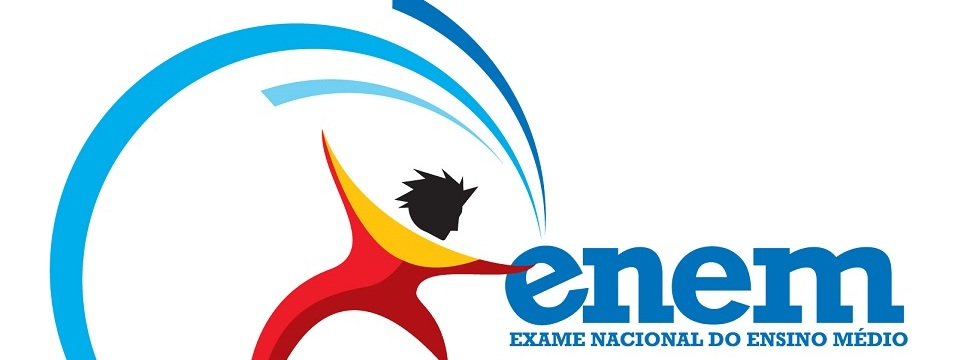

# Projeto-2

<!----------------------Anotações------------------------>

    <!--Carousel-->
    <!--

        <ol class="carousel-indicators">
            <li data-target="#carouselExampleIndicators" data-slide-to="0" class="active"></li>
            <li data-target="#carouselExampleIndicators" data-slide-to="1"></li>
            <li data-target="#carouselExampleIndicators" data-slide-to="2"></li>
        </ol>
        

            

                
            

            

                
            

            

                
            

        

        <a class="carousel-control-prev" href="#carouselExampleIndicators" role="button" data-slide="prev">
            
            Anterior
        </a>
        <a class="carousel-control-next" href="#carouselExampleIndicators" role="button" data-slide="next">
            
            Próximo
        </a>
    
-->
    <!--End Carousel-->

    <!-- etec news
    

        

            

                <a href="https://goo.gl/maps/DsTyDvbwt7EkA9je6" target="_top">
                    
            Etec
                    Etec
                    Etec
                    Etec
                    
                    
            News
                    News
                    News
                    News
                    
                    
                </a>
            

        

        
            

        

        etec news fim-->

        <!--Boas vindas
    <section class="jumbotron text-center">
        

            

                <h1 class="jumbotron-heading">Sejam Bem-Vindos ao EtecNews!!</h1>
                
Lorem ipsum dolor sit, amet consectetur adipisicing elit. Doloribus sunt deserunt aliquid dolore ex iusto quae quam cupiditate exercitationem deleniti omnis, accusantium quia ipsam atque fuga repellendus voluptas. Sunt, voluptatum!

                

                    <a href="#" class="btn btn-warning">Notícias Principais</a>
                

            

        

    </section> -->

    <!-- <section id="feature-one">
            

                

                    

                        

                            <iframe width="100%" height="315" src="https://www.youtube.com/embed/aVS4W7GZSq0" frameborder="0" allow="accelerometer; autoplay; encrypted-media; gyroscope; picture-in-picture" allowfullscreen></iframe>
                        

                        

                            <h6>Assista isso!</h6>
                            <h2>Mensagem do nosso Diretor!</h2>
                            
Vídeo com a mensagem do Diretor Prof. César da Etec Lins, dando as boas vindas ao retorno dos alunos ao primeiro semestre letivo de 2021.
                            

                        

                    

                

            

        </section> -->

        <!-------Anotações------->
/*Carousel

.bg-carrosel {
    width: 100% !important;
    height: 100vh;
    object-fit: cover;
}

.carousel-inner>.carousel-item>img {
    width: 700px;
    height: 500px;
} */

/*etec news começo

@import url("https://fonts.googleapis.com/css2?family=Roboto+Flex:opsz,wdth@8..144,100;8..144,151&display=swap");
body {
    font-family: "Roboto Flex", "Segoe UI", -apple-system, BlinkMacSystemFont, Roboto, Oxygen-Sans, Ubuntu, Cantarell, "Helvetica Neue", sans-serif;
    line-height: 1.4;
    background-color: ;
    color: ;
    background-image: ;
    background-size: 6vw 6vw;
    background-position: 50% -0.1vw;
}

#In {
    position: relative;
    box-sizing: border-box;
    width: 78vw;
    height: 30vw;
    margin: 17.95vw auto 0 calc(50% - 38.95vw);
    background-color: #000;
    border: 0.1vw solid #444;
    perspective: 400vw;
    transform-style: preserve-3d;
}

#Best {
    display: block;
    margin: -8vw auto 0 auto;
    width: 50vw;
    height: 42vw;
    position: relative;
    overflow: visible;
    transform-style: preserve-3d;
    animation-duration: 5s;
    animation-iteration-count: infinite;
    animation-timing-function: ease-in-out;
    animation-direction: alternate;
}

#Best p {
    display: block;
    width: 50vw;
    height: 42vw;
    perspective: 160vw;
    animation-duration: 4s;
    animation-iteration-count: infinite;
    animation-timing-function: ease-in-out;
    animation-direction: alternate;
}

#Best a {
    display: block;
    perspective: 160vw;
}

#Best a:focus,
#Best a:hover,
#Best a:visited,
#Best a:active,
#Best a:link {
    text-decoration: none;
    color: #fff;
}

#Best a:focus,
#Best a:hover {
    outline: none;
}

.box {
    display: block;
    width: 50vw;
    height: 10vw;
    margin-top: 4vw;
    position: relative;
    transform-style: preserve-3d;
    transform: translateZ(-20vw) rotateX(30deg);
    animation-duration: 7s;
    animation-iteration-count: infinite;
    animation-timing-function: linear;
    animation-direction: normal;
}
*/

/*@media screen and (prefers-reduced-motion: no-preference) {
    #Best {*/
        /*     animation-name: wobble; */
/*    }
    #Best p {
        animation-name: rock;
    }
    .box {
        animation-name: spin;
    }
}

.face {
    box-sizing: border-box;
    position: absolute;
    width: 50vw;
    height: 10vw;
    line-height: 0.55;
    font-size: 14.2vw;
    text-transform: uppercase;
    letter-spacing: 0em;
    overflow: hidden;
}

@supports (font-variation-settings: "wdth" 115) {
    .face {
        font-variation-settings: "wdth" 115;
        line-height: 0.75;
        transition: font-variation-settings ease-in 0.5s;
    }
}

#Best a:focus .face,
#Best a:hover .face {
    font-variation-settings: "wdth" 124.5;
}

#Best a:focus .face {
    outline: 0.3vw solid #0f0;
}

.face.fr {
    transform: rotateY(0deg) translateZ(5vw);
    background-color: rgba(255, 0, 0, 0.2);
}

.face.ba {
    transform: rotateY(180deg) translateZ(5vw) rotateZ(180deg);
    background-color: rgba(0, 255, 0, 0.2);
}

.face.to {
    transform: rotateX(90deg) translateZ(-5vw) rotateX(180deg);
    background-color: rgba(0, 0, 255, 0.2);
}

.face.bo {
    transform: rotateX(-90deg) translateZ(-5vw) rotateX(180deg);
    background-color: rgba(255, 0, 255, 0.2);
}

@keyframes spin {
    0% {
        transform: translateZ(-20vw) rotateX(360deg);
    }
    25% {
        transform: translateZ(-20vw) rotateX(270deg);
    }
    50% {
        transform: translateZ(-20vw) rotateX(180deg);
    }
    75% {
        transform: translateZ(-20vw) rotateX(90deg);
    }
    100% {
        transform: translateZ(-20vw) rotateX(0deg);
    }
}

@keyframes rock {
    0% {
        transform: rotateZ(-5deg);
    }
    100% {
        transform: rotateZ(5deg);
    }
}

@keyframes wobble {
    0% {
        transform: rotateY(-5deg);
    }
    100% {
        transform: rotateY(5deg);
    }
}

.face.fr,
.face.ba {
    background-color: #000;
    color: #fff;
}

.face.to,
.face.bo {
    background-color: #fff;
    color: #000;
}

#Viewed span {
    font-size: 2vw;
    display: block;
    text-align: center;
    width: max-content;
    position: absolute;
    top: 13.5vw;
}

#Viewed span:first-child {
    left: 0;
    transform: rotateZ(270deg);
}

#Viewed span:last-child {
    right: 0;
    transform: rotateZ(90deg);
}*/